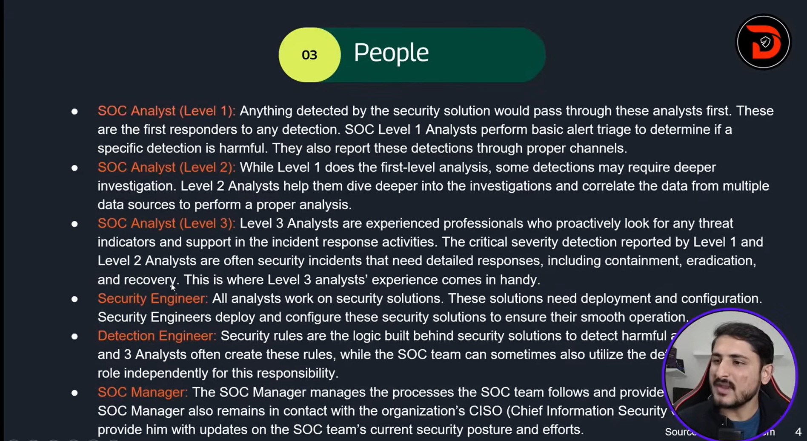
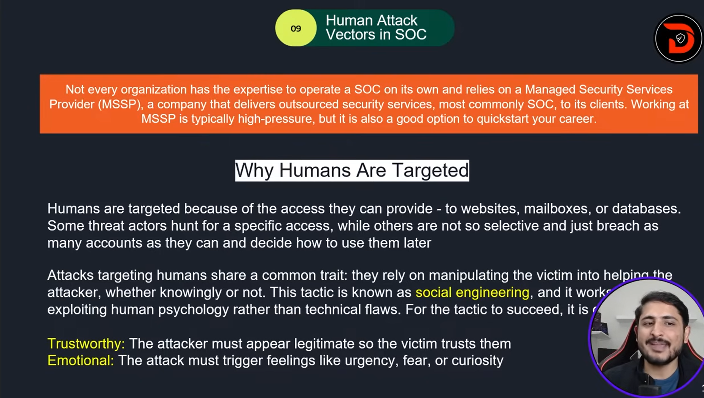

# Class 2 | Human Attack Vectors, People, Process & Technology(PPTs)

- _SOC_
  A SOC (Security Operations Center) is a dedicated facility operated by a specializes security team. This team aims to continuously monitor an organization,s network and resources and identify suspicious activity to prevent damage.

- _Daily Duties being a SOC Analyst_
  - Detect and prevent a data staler infection on a coworker's laptop.
  - Analyze and stop a phishing campaign targeting the finance term.
  - Participate in a bigger incident, such as a full -scale ransomware attack
  - Team up with your teammates to build rules and automation.
  - Go beyond cyber and understand how companies operate from the inside

---

- _As a Tier-1 SOC analyst. You are the first responder. you monitor, triage, escalate, and document event security alert._
  - Monitor SIEM, EDR/XDR, firewall, email alerts
  - Validate alerts: True Positive vs False Positive
  - Escalate critical events to Tier -2/IR
  - Log everything in ticketing systems

---

## Core Concept

- The main focus of the SOC team is to keep Detection and Response intact.
- **People**, **Process** , and **Technology** coexist in a SOC environment. A Team of professional individuals working on state-of the art security tools in the presence of proper processes is what makes a mature SOC environment.

- **_CISO_** (Chick Information Security Officer)
  - **SOC Manager**
    - _SOC Analyst (Level 1)_
    - _SOC Analyst (Level 2)_
    - _SOC Analyst (Level 3)_
    - _Security Engineer_
    - _Detection Engineer_

---

## People

---

## Process

1. **_Alert Triage_**
   The Alert Triage is the basis of the SOC team. The First response to any alert is to perform the triage

<mark> Alert </mark>: Malware detected on Host : XYZ PC

<mark>5 Ws Answers</mark>

**What?** : A malicious file was detected on one of the host inside the organization's network.
**When?** : The file was detected at 13:20 on june 5, 2024.
**Where?** : The file was detected in the directory of the host : "XYZ PC"
**WHO?** : The file was detected for the user "XYZ PC"
**WHY?** : After the investigation. It was found that the file was downloaded from a pirated software selling website. The investigation with the user revealed that they downloaded the file as they wanted to use a software for free.

2. **_Reporting_**
   The detected harmful alerts need to be escalated to higher-level analysts for a timely response and resolution. These alerts are escalated as tickets and assigned to the relevant people. The report should discuss al the 5 Ws along with a through analysis, and screenshots should be used as evidence of the activity.

3. **_Incident Response and Forensics_**
   Sometimes the reported detections point to highly malicious activities that are critical. In these scenario, high-level teams initiate an incident response.

   A few times, a detailed forensics activity also needs to be performed. This forensic activities to determine the incident's root cause.

---

## Technology

Having the right people and processes in place would never be enough without security solutions for detection and response. The Technology portion on the SOC pillars refers to the security solutions. these security solutions efficiently minimize the soc team's manual effort to detect and respond to threats.

Let's get a brief understanding of some of those security solutions.

1. **SIEM**
   Security information and event management is a popular tool used in almost every soc environment. This tool collets logs from various network devices. referred to as log sources.
   Detection rules are configured in the SIEM solution, which contains logic to identify suspicious. The SIEM solution provides us with the detections after correlating them with multiple log .
   Note : The SIEM solution only provides the Detection capabilities in a SOC environment.

2. **EDR**
   Endpoint Detection and Response (EDR) provides the SOC team with details real-time and historical visibility of the devices activities. It operates on the endpoint level and can carry out automated responses. EDR has extensive detection capabilities for endpoints, allowing you to investigate them in detail and respond with a few click.

3. **Firewall**
   A firewall functions purely for network security and acts as a barrier between your internal and external network. It monitors incoming and outgoing network traffic and filters any unauthorized traffic. The firewall also has some detection rules deployed, which help us identify and block suspicious traffic before it reaches the internal network

Several other security solutions play unique roles in a SOC environment, such as antivirus, EPP (Endpoint Protection Platform), IDS/IPS, XDR (Extended Detection and Response), SOAR(Security Orchestration Automation, and Response ).

---

## Human Attack Vectors in SOC

