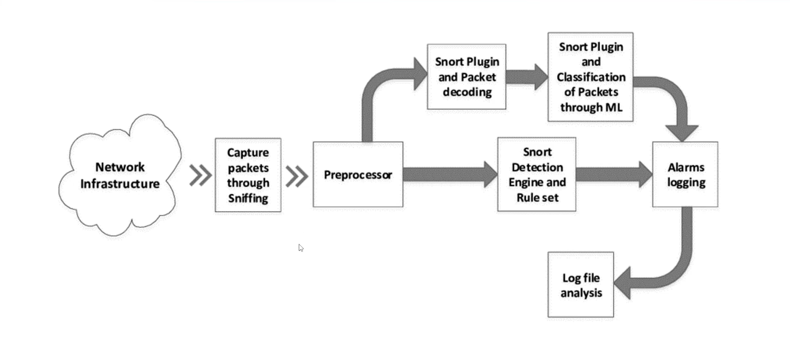

## Intrusion Detection Systems (IDS)

- Intrusion Detection is the process of actively discovering threats/attacks/intrusions on a network, hosts or services.
- There are 2 types of IDS solutions based on the placements, a host-based IDS (HIDS) is setup on an individual host on a network and a network IDS (NIDS) is placed within a network to monitor traffic to and from all hosts on a network
- An IDS is a system/host planted within a network to capture traffic and identify malicious activity based on predefined rules, after which, this malicious activity is logged, and a notification is sent to the relevant parties informing them of an intrusion
- Intrusion detection systems are typically coupled with the functionality to also perform intrusion prevention, whereby specific rules can be set to drop packets that are malicious or intrusive.

---

## Introduction To Snort

- Snort is a popular free and open-source IDS/IPS system that is used to perform traffic/protocol analysis, content matching and can be used to detect and prevent various attacks based on predefined rules

- Snort has been active development and has thousands of users and contributors that develop rules to keep Snort Up to date with the latest attacks

- **Snort has 3 main operational modes**
  - _Packet Sniffing_ : Collects and displays network traffic like what WireShark does .
  - _Packet Logging_ : Collects and logs network traffic into a file .
  - _Network Intrusion Detection_ : Analyzes packets and matches traffic against signatures .

- Snort detects malicious traffic or attacks by leveraging pattern matching
- When active, Snort captures packets, reassembles them, analyzes them and determines what needs to be done to the packet based on predefined rules.
- Snort rules are very similar to a typical firewall rule, whereby , they are used to match network activity against specific patterns or signatures and consequently make a decision as to whether to send an alert or drop the traffic.
- Snort has a large amount or rule-sets created by the community that are very useful to begin with

## Snort Rule Syntax

```bash
# Syntax
alert icmp 192.168.1.10 any -> any any (msg : "ICMP Attempt Attack" ; sid:1000005)

# Rule Header
alert icmp 192.168.1.19 any -> any any

# Rule Option
(msg : "ICMP Attempt Attack" ; sid:1000005)
```

## SNORT Rule Header

| Syntax       | Description         |
| ------------ | ------------------- |
| alert        | Action              |
| icmp         | Protocol            |
| 192.168.1.10 | Source Address      |
| any          | Source Port         |
| ->           | Direction           |
| any          | Destination Address |
| any          | Destination Port    |

## How Snort Works



## Snort IDS/IPS Network Placement

- **_IPS_**
  - Switch + IPS + Firewall + Router + Internet
  - IPS is between Switch and Router
- **_IDS_**
  - (Switch In IDS) + Firewall + Router + Internet
  - IDS is placed on the Switch

- Snot Download "snort.org"
- Creating Your Snot Rule "[cyb3rc3c.net](https://www.cyb3rs3c.net/)"

- Check the netAddr

```bash
$ ifconfig
$ ip a s
```

## Snort Configuration

```bash
$ ls -all /etc/snort
$ mv snort.conf snort_backup-conf
  ipvar HOME_NET 192.168.2.0/24

$ sudo snort -T -i <net_name> /etc/snort/snort.conf

# Change the Rule / Custom the RUle
$ sudo vim /etc/snort/snort.conf

# Comment All the Rule
$ :578,696/^/#

# Run snort again
$ sudo snort -T -i <net_name> /etc/snort/snort.conf
```

## Creating basic Rules

```bash
$ sudo vim /etc/snort/rules/local.rules
  alert icmp any any -> $HOME_NET any ( msg:"ICMP PING Detected";  sid:100001; rev:1; )
  alert tcp any any -> $HOME_NET 22 ( msg:"SSH Authentication Attempt";  sid:100002; rev:1; )

$ sudo snort -q -l /var/log/snort -i <net_name> -A console -c /etc/snort/snort.conf

# In Kali Linux
$ ssh msfadmin$<ip>


# -q = Quite Mode
# -l = Log
# -i = Interface
# -A = Action Mode
# -c Configuration File

```
