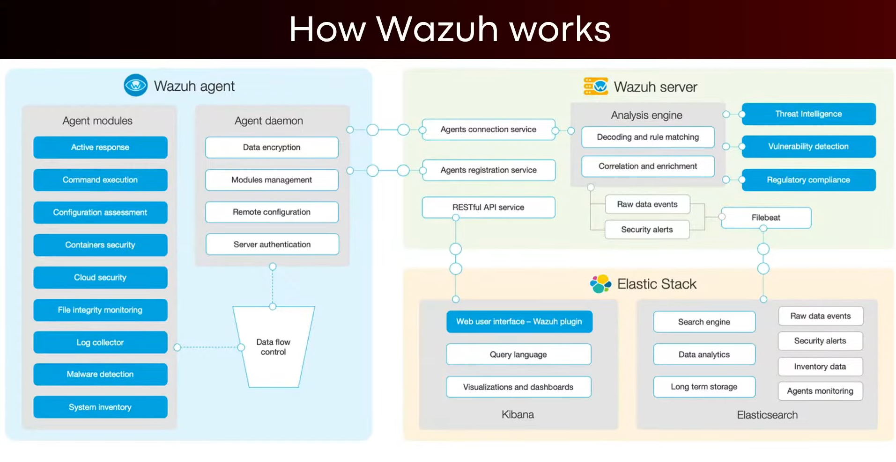

## Intrusion Detection with Wazuh

- Wazuh is a free open source security platform that unifies XDR and SIEM Capabilities

## Wazuh Features

- Intrusion Detection. Wazuh agents scan the monitored systems looking for malware, rootkits and suspicious anomalies...
- Log Data Analysis
- File integrity monitoring
- Vulnerability detection
- Configuration assessment
- Incident response
- Regulatory compliance
- Cloud Security

## Wazuh Components

- **Central Components**
  - _Indexer_
  - _Server_
  - _Dashboard_
- **Endpoint Components**
  - _Agent_

---

# NEW

## Introduction to Wazuh

- Wazuh is a free and open source platform that is used for threat detection, prevention and response.
- It is typically used to protect network, virtualized environments, containers and cloud environments
- In the context of blue team operations, Wazuh is a SIEM (Security Information Event Monitoring) system that is used to collect, analyze, aggregate, index and analyze security related data consequently allowing you to detect intrusions, attacks, vulnerabilities and malicious activity.
- We will be using Wazuh to monitor security events and identify vulnerabilities on agents

- **Wazuh Features** : Security Analytics, Intrusion Detection, Log Data Analysis, File Integrity Monitoring, Vulnerability Detection, Incident Response, Cloud Security, Container Security, Regulatory Compliance

## How Wazuh Works

Wazuh consists of the following components

- _Wazuh agent_ : Cross platform endpoint security agent that is installed on the system/host would like to monitor
- _Wazuh server_ : Analyzes the data received from the Wazuh agents, process this data and matches it agains rule-sets to identify indicators of compromise (IOCs).
- _Elastic Stack_ : Displays and indexes the alerts generated by the Wazuh server and provides users with robust data visualization and analysis functionality

-> Note : Wazuh can also be used to monitor devices like networking equipment that can't run to wazuh agent. This works by getting the devices to send their logs

## How Wazuh Works



## Wazuh Login

Email : jemere8036@gwshare.com

---

## Integrations

- **Antivirus**
  - ClamAV
  - Kaspersky Antivirus
  - McAfee Antivirus
  - Sophos Antivirus
  - Symantec Endpoint Protection
- **Endpoint Detection and Response (EDR)**
  - Crowd Strike Falcon
  - Carbon Black
  - Cylance PROJECT
  - Sentinel One
  - Microsoft Defender for Endpoint
- **Security Orchestration, Automation, and Response (SOAR)**
  - Shuffle SOAR
  - Cortex XSOAR
  - Siemplify
  - Swimlane
- **Incident Response**
  - The Hive
  - MISP (Malware Information Sharing Platform)
  - IR Flow
  - IBM Resilient
  - Splunk Phantom
- **Threat Intelligence**
  - Virus Total
  - AlienVault OTX
- **IDS/IPS**
  - Suricata
  - Snort
  - Zeek
- Vulnerability Management
- **Log Management and SIEM**
  - Graylog
  - Grafana
  - Elastic Stack
- **Cloud Security**
  - Aws CloudTrail
  - Azure Security Center
  - CloudFlare
- ## Compliance and Auditing

---

## Install Wazuh

😀😀

```bash
# Install Wazuh
$ curl -sO https://packages.wazuh.com/4.14/wazuh-install.sh && sudo bash ./wazuh-install.sh -a

# Get the Password
$ sudo tar -O -xvf wazuh-install-files.tar wazuh-install-files/wazuh-passwords.txt
```
