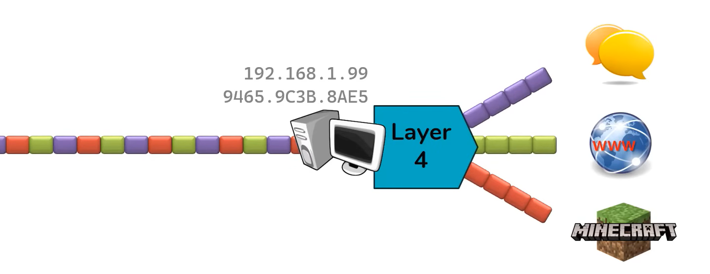
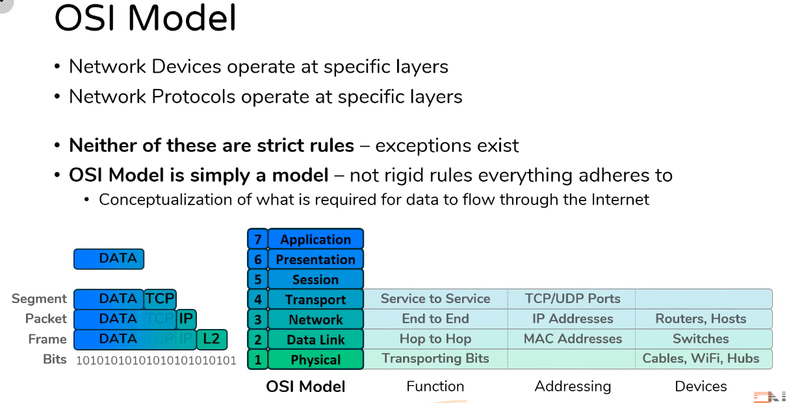

# OSI Model

- Purpose of Networking
  - Allow two hosts to share data with one another
- Hosts must follow a set of rules
  - _Example_ : English language has rules, Bangla language has rules
- The rules for Networking are divided into seven layers
  - OSI Model

- OSI model divides rules of Networking into 7 layers
  - Each layer serves a specific function
  - If all layers are functioning, host can share data

---

## OSI Model

- Goal of Networking : Allow two hosts to share data with one another
- Layer 1 - Physical Layer - Transporting Bits
  - Wires, Cables, Wi-Fi, Repeaters, Hubs
- Layer 2 - Data Link Layer - Hop to Hop
  - MAC addresses, Switches
- Layer 3 - Network Layer - End to End
  - Ip Addresses, Routers, any device with an IP address

---

**_Layer 1 - Physical Transporting Bits_**

- Computer data exists in the form of Bits (1's and 0's)
- Something has to transport those bits between hosts
- L1 Technologies : Cables, Wifi, Repeaters, Hubs, Ethernet, Twisted Pair, Coaxial, Fiber, Wi-Fi, Repeaters, Hubs

**_Layer 2 - Data Link (Hop to Hop) or (Neck to Neck)_**

- Interacts with the Wire
  - NIC - Network Interface Cards
- Addressing Scheme - Mac Addresses
  - 48 bits, represented as 12 hex digits
  - Every NIC has a unique MAC address
- L2 Technologies : NICs, Switches
- Often communication between hosts require multiple hops

**_Layer 3 - Network - End to End_**

- Addressing Schema - IP addresses
  - 32 its, represented as 4 octets, each 0-255
- L3 Technologies : Routers, Hosts, (Anything with an IP)
- ARP - Address Resolution Protocol
  - Links a L3 address to a L2 address
  - ARP will be discussed later in this module

**_Layer 4 - Transport - Service to Service_**

- Distinguish data streams
- Addressing Scheme - Ports - 0 - 65535, TCP or UDP
  - 0 - 65535 : TCP : Favors reliability
  - 0 - 65535 : UDP : Favors efficiency
- Servers Listen for requests to pre-defined Ports
- Clients selects random Port for each connection

**_Layer 5,6,7 - Session, Presentation, Application_**

- Distinction between these layers is somewhat vague
- Other Networking Models combine these into one layer
- L1 - L4 are most important to understand how data flows

---

## Keys Take Ways

- Network Devices operate at specific layers
- Network Protocols operate ate specific layers
- Neither of these are strict rules - Exceptions exist
- OSI Model is simply a model - not rigid rules everything adheres to
  - Conceptualization of what is required for data flow through the internet

