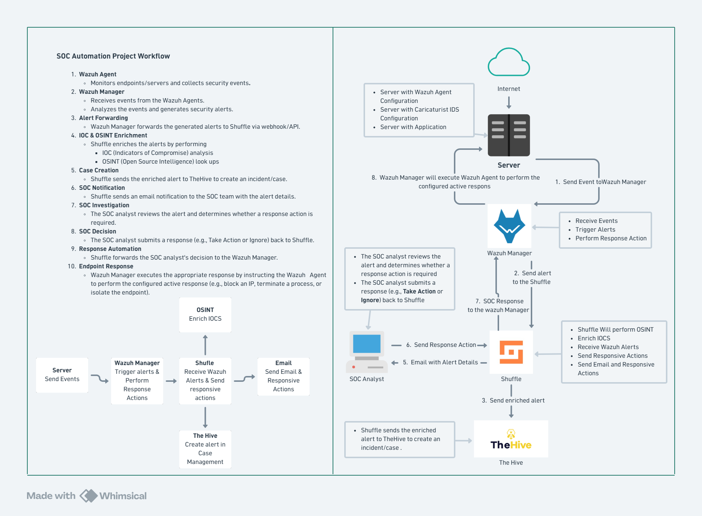

# Soc Automation Project

## Tools

- Wazuh :
  - SIEM : Security Information and Event Management
  - XDR : Extended Detection and Response
- The Hive : Case management
- The Shuffle : SOAR Capability

## Part 1 : SOC Automation Project Workflow

1.  **Wazuh Agent**
    - Monitors endpoints/servers and collects security events.
2.  **Wazuh Manager**
    - Receives events from the Wazuh Agents.
    - Analyzes the events and generates security alerts.
3.  **Alert Forwarding**
    - Wazuh Manager forwards the generated alerts to **Shuffle** via webhook/API.
4.  **IOC & OSINT Enrichment**
    - Shuffle enriches the alerts by performing:
      - IOC (Indicators of Compromise) analysis.
      - OSINT (Open Source Intelligence) lookups.
5.  **Case Creation**
    - Shuffle sends the enriched alert to **TheHive** to create an incident/case.
6.  **SOC Notification**
    - Shuffle sends an email notification to the SOC team with the alert details.
7.  **SOC Investigation**
    - The SOC analyst reviews the alert and determines whether a response action is required.
8.  **SOC Decision**
    - The SOC analyst submits a response (e.g., **Take Action** or **Ignore**) back to Shuffle.
9.  **Response Automation**
    - Shuffle forwards the SOC analyst's decision to the Wazuh Manager.
10. **Endpoint Response**
    - Wazuh Manager executes the appropriate response by instructing the Wazuh Agent to perform the configured active response (e.g., block an IP, terminate a process, or isolate the endpoint).

