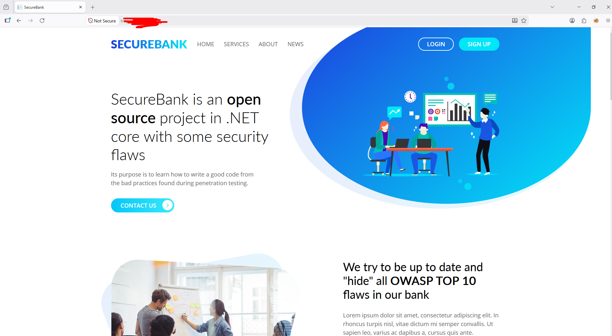
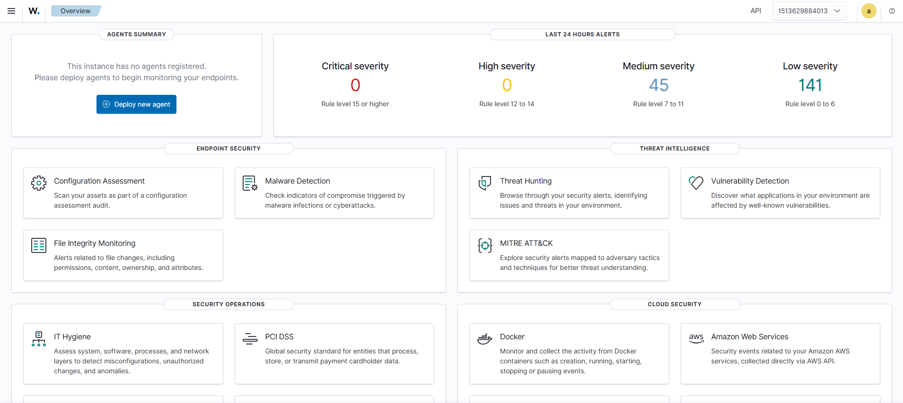
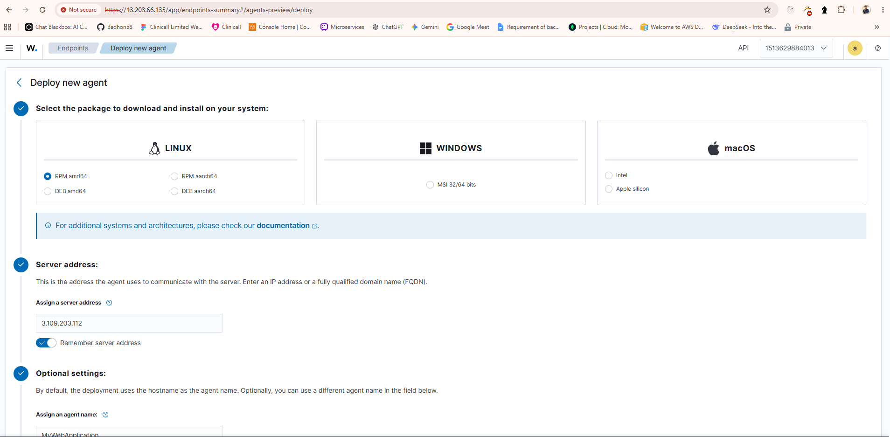
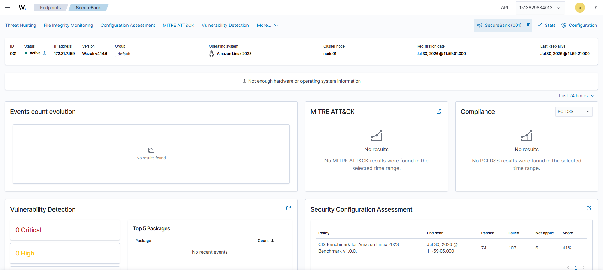
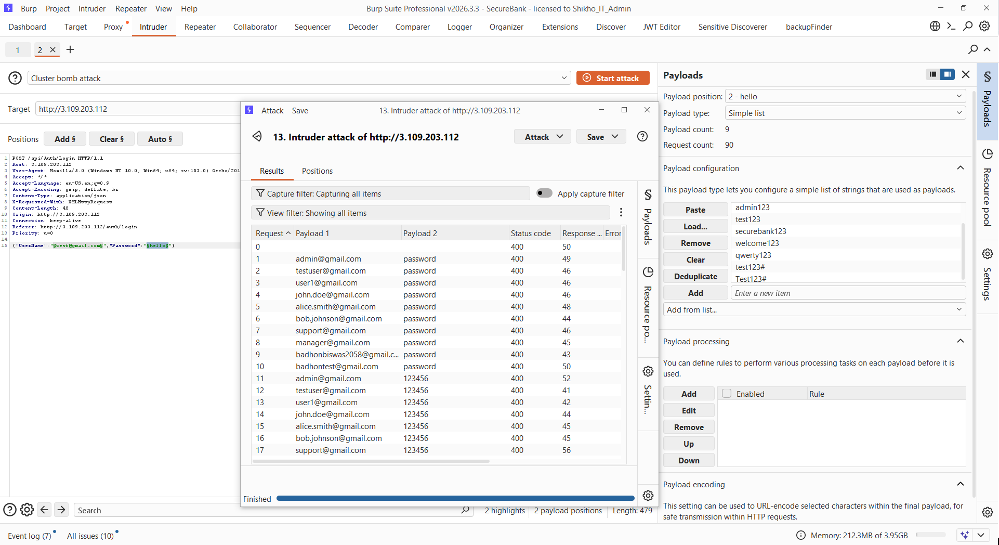

# Brute Force Attack

## Requirements

Create **2 AWS EC2 instances** with **Amazon Linux**.

- **Web Server** – Hosts the SecureBank application
- **Wazuh Server** – Hosts the Wazuh SIEM

Install the following on both servers:

- Docker
- Docker Compose
  - 
- Git

---

### Web-Server

Clone the SecureBank repository.

```bash
git clone https://github.com/ssrdio/SecureBank.git

# Navigate to the project directory.
cd SecureBank

# Modify the `docker-compose.yml` file if needed, then start the application.
docker compose up -d
```

Image:


---

## Wazuh Server Setup

Clone the Wazuh Docker repository.

```bash
$ git clone https://github.com/wazuh/wazuh-docker.git -b v4.14.6

# Navigate to the deployment directory.
$ cd wazuh-docker/multi-node

# Generate the required certificates.
$ docker compose -f generate-indexer-certs.yml run --rm generator

# Start the Wazuh services.
$ docker compose up -d

# UserName : admin
# Password : SecretPassword
```

If Not Working

```bash
$ sudo mkdir -p /root/.docker/cli-plugins

$ sudo cp ~/.docker/cli-plugins/docker-compose /root/.docker/cli-plugins/docker-compose

$ sudo chmod +x /root/.docker/cli-plugins/docker-compose

$ sudo docker compose version

$ sudo usermod -aG docker ec2-user

$ sudo docker compose -f generate-indexer-certs.yml run --rm generator
```



---

Wazuh Agent Set Up
Note : The ip of that server address will be the wazuh dashboard





---

## Now Lets Perform Brute Force Attack

Set Up the brup Suite For Attack

- InterSecpet the traffic
  

- Live Traffic Capture
  
  
  - Send it to the Intruder

- Cluster Attack Using Brup Suite
  

- Check On the Threat Hunter
  
  

---

# Linux System Monitoring

## Action Creation & Manipulation